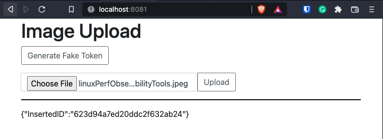

- [Image Upload Service](#image-upload-service)
  - [Features](#features)
  - [TODO](#todo)
  - [Tech Stack](#tech-stack)
- [Getting Started](#getting-started)
- [Let's GO!](#lets-go)
- [Build](#build)
- [Test](#test)
- [For Additional Information, please refer to the WIKI.md](#for-additional-information-please-refer-to-the-wikimd)
# Image Upload Service

Looking for a simple image upload app that will save the data to a hot folder 
and save the details in the database? 

Check out the `docs` folder for the high level design and sample use case!

## Features

- Simple Authentication 
- Uploading Image File 
    - Allowed extensions [ .png, .jpeg, .gif ]
    - Max Size [ 8MB ]

## TODO
- [ ] Trace Header
- [ ] Healthcheck / Heartbeat for service and dabatase connection
- [ ] Graceful Shutdown
- [ ] Add auth in the header instead rather than part of the form data
- [ ] Add Folder and Max Size to Environment Variable for flexibility 
- [ ] Dockerfile
- [ ] Helm Chart for Configuration Deployment
- [ ] Add more helpful commands in Make
- [ ] Idempotent call for uploading files
  
## Tech Stack

- Go 1.17 & up
- MongoDB

# Getting Started
What you will need?
1. Install VSCode add GO plugin
2. Or you can use IntelliJ and install GO plugin (_GO and GO Linter_)
2. [Go language](https://jimkang.medium.com/install-go-on-mac-with-homebrew-5fa421fc55f5)
3. Docker Desktop
5. Install newman 
   + `npm install -g newman`

# Let's GO!
  Clone the project

```bash
  git clone git@github.com:czarmayne/image-upload.git my-project
```

Go to the project directory

```bash
  cd my-project
```

Install dependencies

```bash
  brew install --cask docker
  docker run -d -it -p 27017:27017 mongo
```

# Build
1. install golang (to verify go --version)
2. go mod init com.brankas.imageupload
3. go mod tidy
4. docker build -t <tagname> .

**Note: Use the Makefile to run different commands**
1. For docker image build and push
    ```
    make default
    ```
2. To clean, build, and push, use 
    ```
    make all
    ```

# Test
If you have a plugin in IntelliJ, just run it using the IDE.
+ Open the Makefile

Else you can run the following command
+ `make run` 
+ `make token`
  + [see token generation](token.md)
+ `make run_postman`
  
Or open your favorite browser then visit
```
    localhost:8081
```
and you should be greeted with the simple web app as seen here:


**Note: You can use the Generate Fake Token to simulate invalid auth**

# For Additional Information, please refer to the [WIKI.md](WIKI.md)